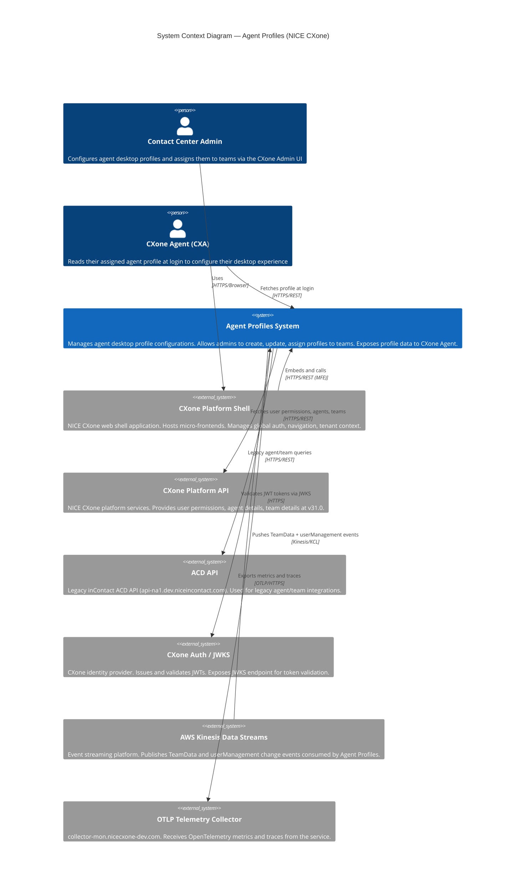
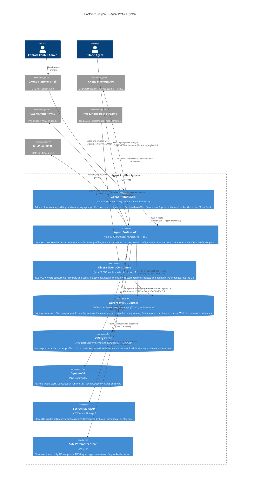
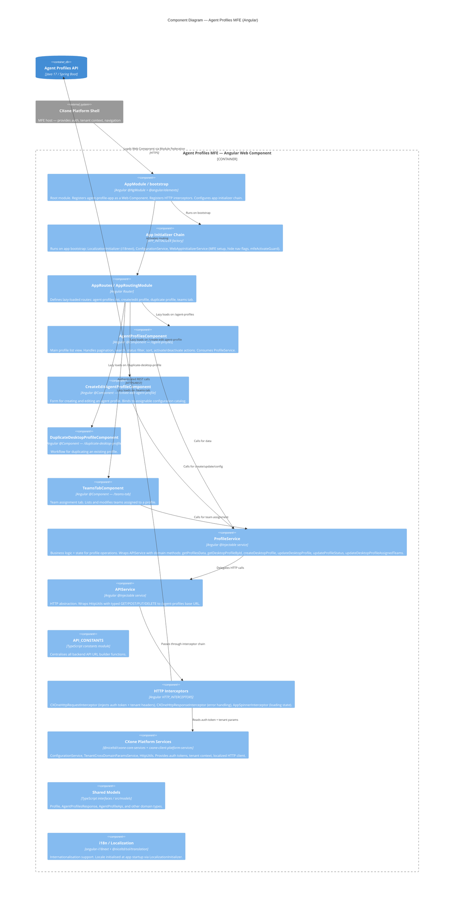
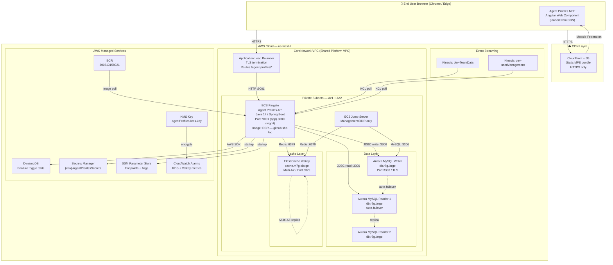
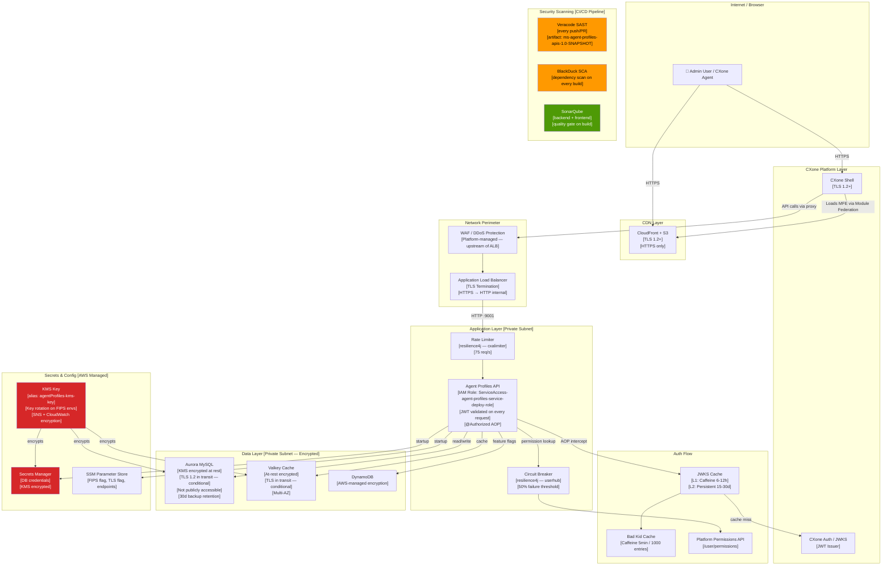
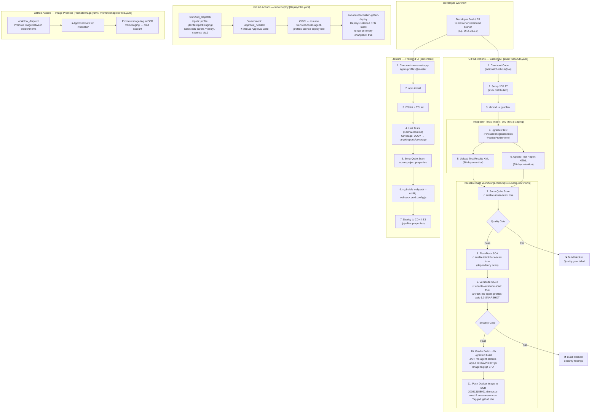
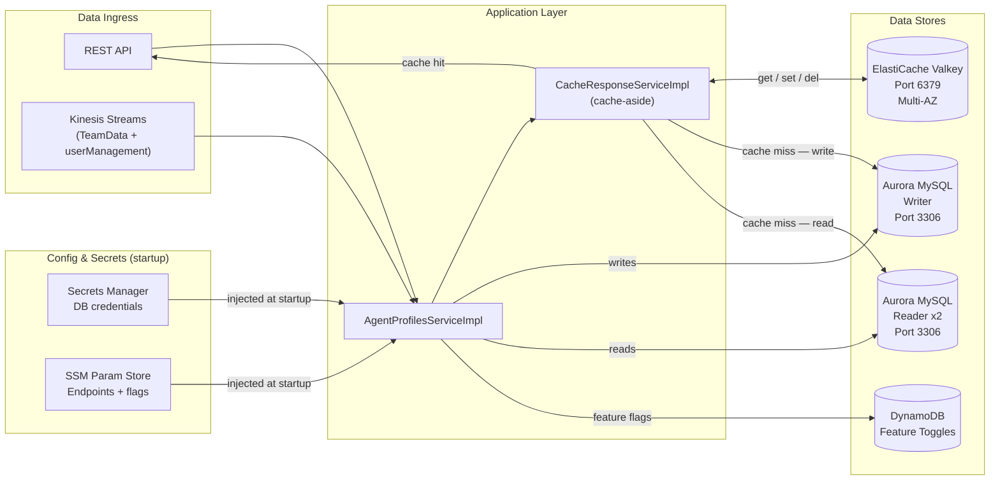
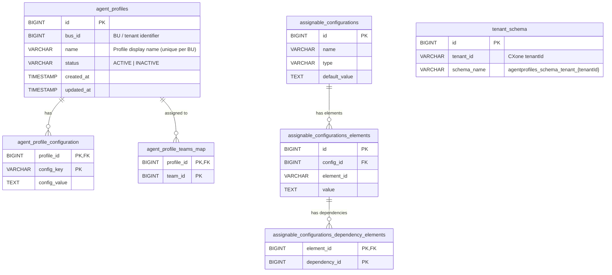

# C4 Architecture Diagrams — Agent Profiles (NICE CXone)
Generated from Architecture Analysis Report — March 22, 2026

---

## Diagram Index
1. [L1: System Context Diagram](#1-l1-system-context-diagram)
2. [L2: Container Diagram](#2-l2-container-diagram)
3. [L3: Component Diagram — Backend API](#3-l3-component-diagram--backend-api)
4. [L3: Component Diagram — Frontend Application](#4-l3-component-diagram--frontend-application)
5. [Deployment Diagram](#5-deployment-diagram)
6. [Security Architecture Diagram](#6-security-architecture-diagram)
7. [CI/CD Pipeline Diagram](#7-cicd-pipeline-diagram)
8. [Data Architecture Diagram](#8-data-architecture-diagram)
9. [Database Design (ERD)](#9-database-design-entity-relationship-diagram)

---

## 1. L1: System Context Diagram

**Description**: The Agent Profiles system sits at the centre of the CXone contact centre platform. Contact Centre Admins interact with it exclusively through the CXone Shell (which hosts the Angular micro-frontend). CXone Agents (desktop app) call the system directly to retrieve their profile at login. The system depends on the CXone Platform API for authorization and entity data, consumes team/user lifecycle events from Kinesis, and emits observability data to an OTLP collector.

| Element | Type | Description |
|---------|------|-------------|
| Contact Center Admin | Person | Creates and manages agent profiles and team assignments |
| CXone Agent (CXA) | Person/System | Consumes assigned profile data at session start |
| Agent Profiles System | Software System | Core subject of this documentation |
| CXone Platform Shell | External System | MFE host; provides auth context and navigation |
| CXone Platform API | External System | Source of user permissions and entity data |
| ACD API | External System | Legacy contact centre API |
| CXone Auth / JWKS | External System | JWT issuer and JWKS validator |
| AWS Kinesis Data Streams | External System | Event source for team/user changes |
| OTLP Telemetry Collector | External System | Observability sink |

---

## 2. L2: Container Diagram

**Description**: The backend API and Kinesis consumers run as a single deployable Spring Boot process on ECS Fargate. The Angular micro-frontend is a stateless SPA deployed via CDN/S3, embedded into the CXone Shell via Module Federation as a Web Component. Aurora MySQL provides durable multi-tenant storage; Valkey provides caching; DynamoDB stores feature flags. All secrets and config are externalized to AWS-managed stores.

| Container | Technology | Responsibilities |
|-----------|-----------|-----------------|
| Agent Profiles MFE | Angular, Web Component, Webpack MFE | Admin UI — profile list, create/edit, team assignment |
| Agent Profiles API | Java 17, Spring Boot, ECS Fargate | REST API, RBAC, business logic, external integrations |
| Kinesis Event Consumers | Java 17, KCL (embedded) | Async event consumption for team/user data sync |
| Aurora MySQL Cluster | AWS RDS Aurora MySQL 8 | Primary persistent store (multi-tenant, encrypted) |
| Valkey Cache | AWS ElastiCache Valkey | Response + JWKS caching |
| DynamoDB | AWS DynamoDB | Feature toggles |
| Secrets Manager | AWS Secrets Manager | DB credential storage |
| SSM Parameter Store | AWS SSM | Runtime configuration |

---

## 3. L3: Component Diagram — Backend API

```mermaid
C4Component
  title Component Diagram — Agent Profiles API (Backend)

  Container_Boundary(backendAPI, "Agent Profiles API — Spring Boot Application") {

    Component(appEntry, "App.java", "Spring Boot @SpringBootApplication", "Application entry point. Initialises Spring context.")
    Component(appConfig, "AppConfiguration.java", "Spring @Configuration", "Wires all beans: HTTP clients, cache, datasource routing, Resilience4j, OTLP, Kinesis.")

    Component(agentProfilesController, "AgentProfilesController", "Spring @RestController — /profiles", "Handles CRUD endpoints for agent profiles and team assignments. Applies @Authorized and @RateLimiter.")
    Component(assignableConfigController, "AssignableConfigurationsController", "Spring @RestController — /assignable-configurations", "Exposes the catalog of assignable configuration items.")
    Component(cxaControllerV1, "GetAgentProfileForCXAController", "Spring @RestController — /cxa/profiles", "CXone Agent v1 profile fetch endpoint.")
    Component(cxaControllerV2, "GetAgentProfileCXAControllerV2", "Spring @RestController — /cxa/v2/profiles", "CXone Agent v2 profile fetch endpoint.")

    Component(authAspect, "AuthAspect", "Spring AOP @Aspect @Around @Authorized", "Intercepts all @Authorized controller methods. Extracts JWT, calls AuthService, checks required permissions. Throws 401/403 on failure.")
    Component(authService, "AuthService", "Spring @Service", "Parses JWT (Nimbus JOSE), extracts userId/buId/tenantId/role from claims. Calls PlatformApiConsumerService to resolve user permissions.")

    Component(agentProfilesService, "AgentProfilesServiceImpl", "Spring @Service — IAgentProfilesService", "Core business logic: create/update/delete profiles, manage team assignments, status updates, search/filter. Orchestrates DAO + Cache + Platform calls.")
    Component(cacheService, "CacheResponseServiceImpl", "Spring @Service — ICacheResponseService", "Reads and writes API responses to/from Valkey. Key-based invalidation on mutations.")
    Component(platformService, "PlatformApiConsumerServiceImpl", "Spring @Service — IPlatformApiConsumerService", "HTTP client to CXone Platform API. Fetches user permissions (/user/permissions), agent details (/agents/), team details (/teams). Circuit breaker protected.")

    Component(agentProfilesDao, "AgentProfilesDaoImpl", "Spring @Repository / JPA", "DB access for AgentProfiles entity. Supports read/write replica routing. Flyway-managed schema.")
    Component(teamsMapDao, "AgentProfileTeamsMapDaoImpl", "Spring @Repository / JPA", "DB access for AgentProfileTeamsMap junction table.")

    Component(kinesisConsumer, "KinesisConsumer", "KCL Worker Bootstrap", "Starts two KCL workers for TeamData and userManagement streams.")
    Component(teamDataProcessor, "TeamDataRecordProcessor", "KCL IRecordProcessor", "Processes team create/rename/delete events. Updates AgentProfileTeamsMap in DB.")
    Component(userMgmtProcessor, "UserManagementRecordProcessor", "KCL IRecordProcessor", "Processes agent hire/terminate/role-change events.")

    Component(jpaEntities, "JPA Entities", "Jakarta @Entity classes", "AgentProfiles, AgentProfileConfiguration, AgentProfileTeamsMap, AssignableConfigurations, TenantSchema, MappedCreatedUpdatedEntity")
    Component(dtos, "DTOs", "POJO / @Valid annotated", "AgentProfileRequest, AgentProfileStatusChangeRequest, AgentProfileTeamsMapRequestDTO, GetAgentProfilePayloadDTO, SuccessResponseDTO")
    Component(validationUtils, "AgentProfileValidationUtils", "Utility class", "Input validation for request params and profile request bodies.")
    Component(logContext, "LogAttributesThreadLocal", "MDC ThreadLocal", "Injects correlation IDs and tenant context into log records.")
  }

  ContainerDb(auroraDB, "Aurora MySQL", "", "")
  ContainerDb(valkeyCache, "Valkey Cache", "", "")
  ContainerDb(dynamoDB, "DynamoDB", "", "")
  System_Ext(cxonePlatformAPI, "CXone Platform API", "")
  System_Ext(cxoneAuth, "CXone Auth / JWKS", "")
  System_Ext(kinesisStreams, "AWS Kinesis", "")

  Rel(agentProfilesController, authAspect, "Intercepted by (AOP)")
  Rel(authAspect, authService, "Delegates JWT validation + permission check")
  Rel(authService, valkeyCache, "L1/L2 JWKS cache lookup")
  Rel(authService, cxoneAuth, "Fetch JWKS on cache miss", "HTTPS")
  Rel(authService, platformService, "Fetch user permissions")

  Rel(agentProfilesController, agentProfilesService, "Delegates business operations")
  Rel(agentProfilesController, validationUtils, "Validates request params")
  Rel(agentProfilesService, cacheService, "Read/write response cache")
  Rel(agentProfilesService, agentProfilesDao, "DB reads and writes")
  Rel(agentProfilesService, teamsMapDao, "Team-profile mapping reads/writes")
  Rel(agentProfilesService, platformService, "Fetch agent/team data")
  Rel(cacheService, valkeyCache, "Redis get/set/del", "Redis protocol")
  Rel(agentProfilesDao, auroraDB, "JDBC queries", "MySQL/TLS")
  Rel(teamsMapDao, auroraDB, "JDBC queries", "MySQL/TLS")
  Rel(platformService, cxonePlatformAPI, "REST calls", "HTTPS")
  Rel(platformService, dynamoDB, "Feature toggle reads", "AWS SDK")

  Rel(kinesisConsumer, kinesisStreams, "Polls shards", "KCL")
  Rel(kinesisConsumer, teamDataProcessor, "Dispatches team records")
  Rel(kinesisConsumer, userMgmtProcessor, "Dispatches user records")
  Rel(teamDataProcessor, agentProfilesDao, "Sync team changes to DB")
  Rel(userMgmtProcessor, agentProfilesDao, "Sync user changes to DB")
```

**Description**: The backend API is composed of a thin controller layer (with AOP-injected auth), a thick service layer (`AgentProfilesServiceImpl` orchestrates all business logic), and a repository layer backed by HikariCP-pooled dual datasource (write/read replicas). Two KCL-based Kinesis workers run as background threads within the same process, processing team and user change events asynchronously.

| Component | Responsibility |
|-----------|---------------|
| `AuthAspect` | AOP gateway — all `@Authorized` endpoints pass through here |
| `AuthService` | JWT decode, claims extraction, JWKS cache management |
| `AgentProfilesServiceImpl` | Core business logic orchestrator (35KB) |
| `CacheResponseServiceImpl` | Valkey read/write/invalidate |
| `PlatformApiConsumerServiceImpl` | External HTTP calls to CXone Platform API |
| `AgentProfilesDaoImpl` | Aurora MySQL read/write via JPA |
| `KinesisConsumer` + Processors | Async event-driven DB sync |

---

## 4. L3: Component Diagram — Frontend Application

**Description**: The Angular MFE is bootstrapped as a Web Component registered via `@angular/elements`. The CXone Shell loads it via Module Federation. The app uses a two-layer service architecture: `ProfileService` for domain logic and `APIService` as an HTTP abstraction. Auth token injection is fully handled by the platform interceptors from `@niceltd/cxone-core-services` — the app never manually handles tokens.

| Component | Responsibility |
|-----------|---------------|
| `AppModule` | Web Component registration, interceptor wiring, MFE bootstrap |
| `ProfileService` | Domain service — all profile API calls with RxJS mapping |
| `APIService` | HTTP wrapper around `HttpUtils` |
| `CXOneHttpRequestInterceptor` | Auto-injects Bearer token + tenant headers |
| `AgentProfilesComponent` | Profile list with pagination/search/sort/status filter |
| `CreateEditAgentProfileComponent` | Create/edit profile form |
| `TeamsTabComponent` | Team assignment UI |

---

## 5. Deployment Diagram

**Deployment Inventory:**

| Layer | Resource | Spec (staging/prod) | Notes |
|-------|----------|--------------------:|-------|
| CDN | CloudFront + S3 | — | MFE static bundle; HTTPS only |
| Network | Shared ALB | Platform-managed | TLS termination; routes `/agent-profiles/*` |
| Compute | ECS Fargate | — | Stateless; ports 9001 / 8080 |
| Database | Aurora MySQL (1 writer + 2 readers) | db.r7g.large | Multi-AZ; 30-day backup; KMS encrypted |
| Cache | ElastiCache Valkey | cache.m7g.xlarge | Multi-AZ; 7-day snapshot |
| Feature store | DynamoDB | On-demand | Feature toggles |
| Secrets | Secrets Manager | — | DB credentials; KMS encrypted |
| Config | SSM Parameter Store | — | Endpoints, FIPS flag, TLS flag |
| Registry | ECR | — | Images tagged by `github.sha` |
| Events | Kinesis (×2) | — | TeamData + userManagement streams |

---

## 6. Security Architecture Diagram

**Security Controls Summary:**

| Layer | Control |
|-------|---------|
| Transport | TLS 1.2+ on all external traffic; conditional TLS on internal DB/cache (env-controlled) |
| Authentication | JWT Bearer token, validated via CXone JWKS (Nimbus JOSE) |
| Authorization | AOP `@Authorized` — per-endpoint RBAC permissions (`VIEW`/`CREATE`/`EDIT`) |
| Rate Limiting | Resilience4j 75 req/s, instant reject |
| Circuit Breaker | Protects Platform API calls; 50% failure threshold |
| JWKS Caching | 2-tier (L1 Caffeine + L2 persistent) reduces JWKS endpoint exposure |
| Encryption at Rest | Aurora: KMS; Valkey: AES; Secrets Manager: KMS |
| Secrets | AWS Secrets Manager (DB creds); SSM (config); no plaintext in app |
| Scanning | Veracode SAST + BlackDuck SCA (backend, every PR); SonarQube (both) |
| IAM | OIDC-based GitHub Actions assume role; `ServiceAccess-agent-profiles-service-deploy-role` |
| FIPS | Enabled on test and perf environments |

---

## 7. CI/CD Pipeline Diagram

**Pipeline Stage Descriptions:**

| Stage | Tool | Gate? | Notes |
|-------|------|-------|-------|
| Integration Tests (3 envs) | Gradle/JUnit | No | Matrix: dev, test, staging profiles |
| SonarQube Scan | SonarQube | ✅ Quality Gate | Blocks on quality gate failure |
| BlackDuck SCA | BlackDuck | No hard block found | Dependency vulnerability scan |
| Veracode SAST | Veracode | ✅ Security Gate | Static analysis on JAR artifact |
| Jib Build + ECR Push | Gradle Jib | No | Image tagged by `github.sha` |
| Infra Deploy | CloudFormation | ✅ Manual Approval | `approval_needed` GitHub environment |
| Image Promote to Prod | ECR | ✅ Manual Approval | Separate `PromoteImageToProd.yaml` |
| Frontend Lint + Test | ESLint/Karma | No explicit gate | Jenkins-managed |
| Frontend SonarQube | SonarQube | No explicit gate | `sonar-project.properties` |

---

## 8. Data Architecture Diagram

**Cache Strategy:**
- **Pattern**: Cache-aside — read from Valkey first; on miss, query Aurora and populate cache
- **Write-through invalidation**: All mutations (create / update / delete / status change) purge affected BU-scoped cache keys
- **JWKS L2 cache**: Also stored in Valkey (15–30d TTL), separate from API response cache

**Data Store Inventory:**

| Store | Type | Purpose | Encryption | HA |
|-------|------|---------|-----------|-----|
| Aurora MySQL (writer) | AWS RDS Aurora | All write operations | KMS at rest, TLS conditional | Multi-AZ auto-failover |
| Aurora MySQL (reader ×2) | AWS RDS Aurora | Read / search queries | KMS at rest, TLS conditional | Auto-promoted on writer failure |
| ElastiCache Valkey | Redis-compatible | API response cache + JWKS L2 cache | AES at rest, TLS conditional | Multi-AZ replica |
| DynamoDB | AWS DynamoDB | Feature toggles | AWS-managed | Fully managed |
| Secrets Manager | AWS Secrets | DB credentials | KMS | Fully managed |
| SSM Parameter Store | AWS SSM | Runtime endpoints + FIPS/TLS flags | AWS-managed | Fully managed |

---

---

## 9. Database Design (Entity Relationship Diagram)

Derived from JPA entities in `src/main/java/com/nice/cxone/agentprofiles/jpa/entities/`.
Schema is per-tenant: `agentprofiles_schema_tenant_{tenantId}`.

**Table Descriptions:**

| Table | PK | Description |
|-------|-----|-------------|
| `agent_profiles` | `id` | Core profile entity. One profile per named configuration set. `bus_id` provides BU-level tenant isolation. `name` unique per BU. |
| `agent_profile_configuration` | `(profile_id, config_key)` | Key-value settings attached to a profile. Composite PK. Deleted and re-inserted on profile update. |
| `agent_profile_teams_map` | `(profile_id, team_id)` | Junction table — many-to-many between profiles and CXone teams. `team_id` references external CXone team IDs (not a FK to a local table). |
| `assignable_configurations` | `id` | Catalog of available configuration types that can be included in a profile (e.g. desktop widgets, tool availability). |
| `assignable_configurations_elements` | `id` | Specific selectable elements within an assignable configuration (e.g. individual tools/options). |
| `assignable_configurations_dependency_elements` | `(element_id, dependency_id)` | Dependency graph between configuration elements — an element may require another element to be selected. |
| `tenant_schema` | `id` | Registry mapping `tenantId` → schema name for dynamic schema routing. |

**Multi-tenancy Note:**  
The `tenant_schema` table is queried at request time to determine which per-tenant MySQL schema to use (`agentprofiles_schema_tenant_{tenantId}`). This is implemented via Spring's `AbstractRoutingDataSource` pattern — the tenant schema name is resolved from the JWT `tenantId` claim and set as the active datasource route.

**Audit Fields:**  
All mutable tables extend `MappedCreatedUpdatedEntity` which provides `created_at` and `updated_at` timestamps managed by JPA lifecycle callbacks (`@PrePersist`, `@PreUpdate`).

---

## Architecture Decisions & Notes

| Decision | Rationale | Trade-off |
|----------|-----------|-----------|
| Embedded KCL consumers (in API process) | Simplifies deployment — single ECS task | Kinesis processing tied to API scaling; high API load could starve event processing |
| Schema-per-tenant multi-tenancy | Strong data isolation at DB level | Schema sprawl with many tenants; Flyway migrations must run per-tenant |
| Dual datasource (write/read replicas) | Separates write and read workloads; read scalability | HikariCP pool count effectively doubled (2 × 100 connections) |
| Cache-aside with Valkey | Reduces Aurora read load and latency for repeated queries | Cache invalidation complexity on mutations |
| Custom AOP `@Authorized` + Platform permissions API | Fine-grained RBAC without Spring Security complexity | Synchronous external call on every request — latency risk (mitigated by circuit breaker; caching recommended) |
| Jib for container builds | No Dockerfile maintenance; fast incremental builds | Less control over image layer structure |
| Module Federation MFE | Independent deployability of UI from shell | Increased complexity in build pipeline; version compatibility with shell required |
