# Flow & Sequence Diagrams — Agent Profiles (NICE CXone)
Generated from Architecture Analysis Report — March 22, 2026

---

## Diagram Index
1. [Authentication & JWT Validation Flow](#1-authentication--jwt-validation-flow)
2. [RBAC Permission Check Flow](#2-rbac-permission-check-flow)
3. [Get Agent Profiles List (Cache-Aside)](#3-get-agent-profiles-list-cache-aside)
4. [Create Agent Profile Flow](#4-create-agent-profile-flow)
5. [Update Agent Profile Flow](#5-update-agent-profile-flow)
6. [Update Profile Status (Bulk) Flow](#6-update-profile-status-bulk-flow)
7. [Assign Teams to Profile Flow](#7-assign-teams-to-profile-flow)
8. [CXone Agent (CXA) Profile Fetch Flow](#8-cxone-agent-cxa-profile-fetch-flow)
9. [Kinesis TeamData Event Processing Flow](#9-kinesis-teamdata-event-processing-flow)
10. [Kinesis User Management Event Processing Flow](#10-kinesis-user-management-event-processing-flow)
11. [DynamoDB Feature Toggle Lookup Flow](#11-dynamodb-feature-toggle-lookup-flow)
12. [Backend CI/CD Pipeline Flow](#12-backend-cicd-pipeline-flow)
13. [Infrastructure Provisioning (CloudFormation) Flow](#13-infrastructure-provisioning-cloudformation-flow)
14. [Error Handling & Resilience Flow](#14-error-handling--resilience-flow)
15. [Frontend Bootstrap & MFE Load Flow](#15-frontend-bootstrap--mfe-load-flow)

---

## 1. Authentication & JWT Validation Flow

Covers the end-to-end JWT validation path including the 2-tier JWKS cache (Caffeine L1 + persistent L2) and bad-kid tracking.

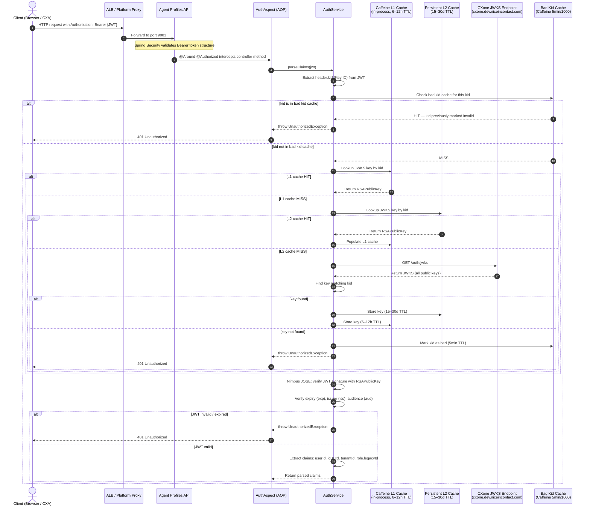

**Key Points:**
- Two-tier JWKS caching dramatically reduces calls to the external CXone JWKS endpoint
- Bad Kid cache (5-min TTL) prevents thundering herd on unknown/rotated key IDs
- Nimbus JOSE+JWT performs full cryptographic signature verification on every request

---

## 2. RBAC Permission Check Flow

Covers the permission resolution path after JWT validation — the call to CXone Platform API and the RBAC gate.

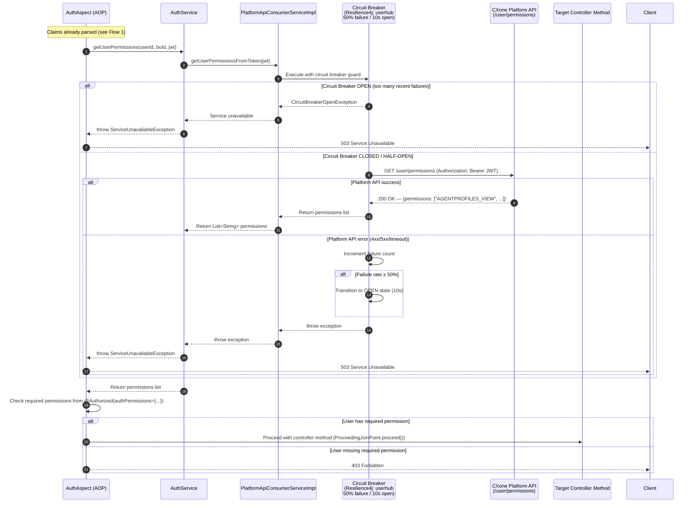

**Key Points:**
- Every API call triggers a synchronous permission check against CXone Platform API
- Circuit breaker (`userhub`) prevents cascading failure when Platform API is degraded
- Recommendation (from Risk #9): Cache permissions in Valkey with ~30s TTL to reduce Platform API load

---

## 3. Get Agent Profiles List (Cache-Aside)

The standard cache-aside pattern for the paginated profile list query.

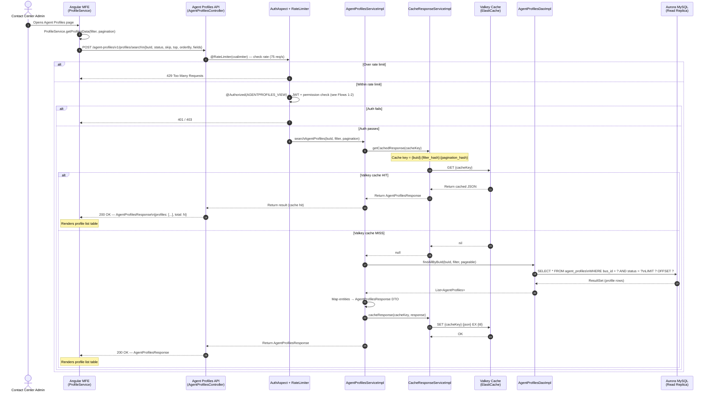

---

## 4. Create Agent Profile Flow

Full lifecycle of creating a new agent profile from the admin UI.

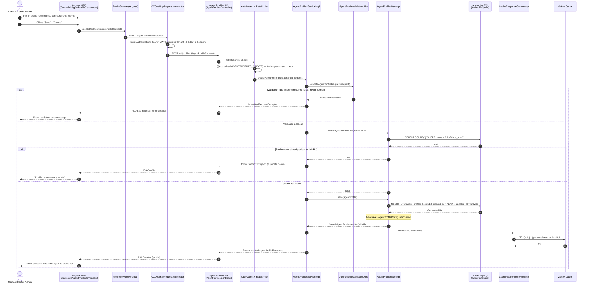

---

## 5. Update Agent Profile Flow

Update an existing profile including configuration changes.

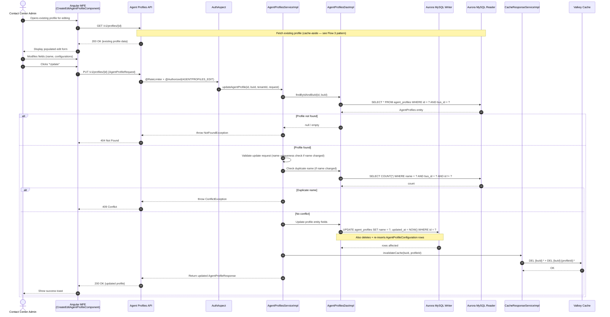

---

## 6. Update Profile Status (Bulk) Flow

Activate or deactivate multiple profiles in one call.

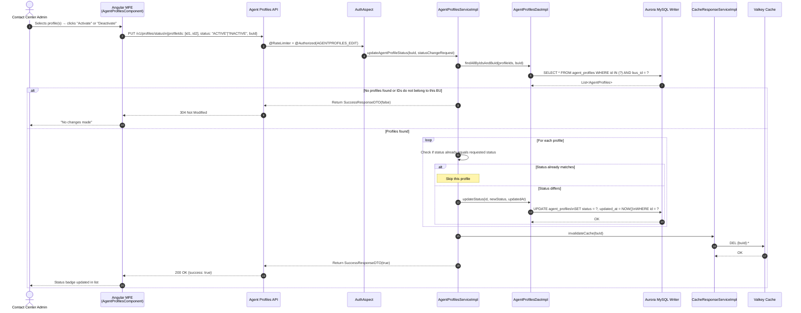

---

## 7. Assign Teams to Profile Flow

Full lifecycle of assigning teams to an existing agent profile.

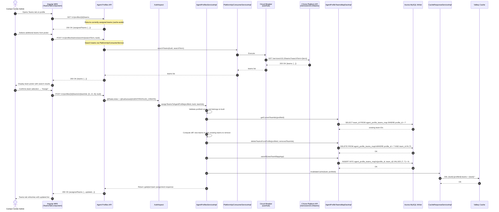

---

## 8. CXone Agent (CXA) Profile Fetch Flow

The lightweight profile fetch called by the CXone Agent desktop app at session start.

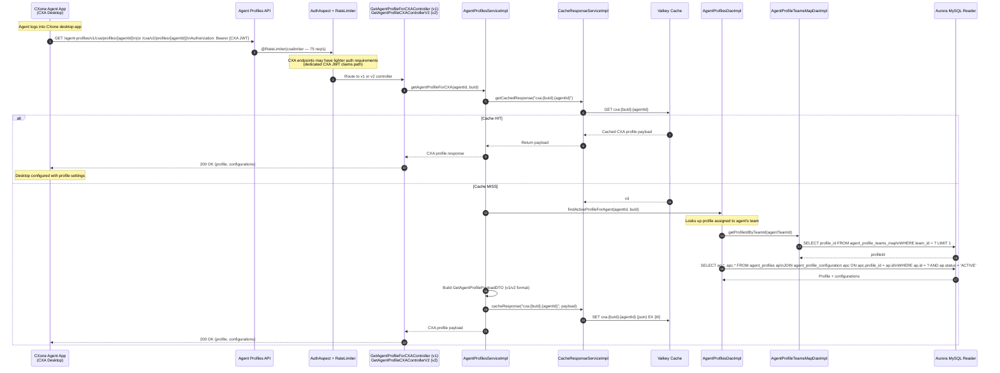

---

## 9. Kinesis TeamData Event Processing Flow

How team lifecycle changes (rename, delete) propagate from the CXone platform into Agent Profiles.

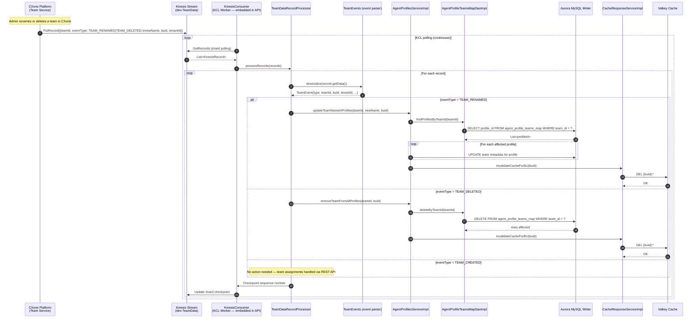

**Key Points:**
- KCL workers run as background threads within the same Spring Boot process as the REST API
- Checkpoint after each batch prevents reprocessing on restart
- Cache invalidation on team events ensures profiles list reflects current team names

---

## 10. Kinesis User Management Event Processing Flow

How agent hire/terminate/role changes propagate from the CXone platform into Agent Profiles.

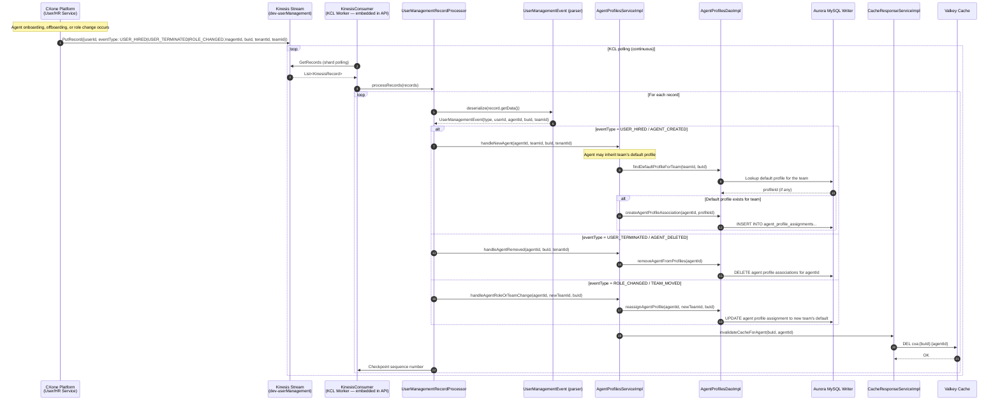

---

## 11. DynamoDB Feature Toggle Lookup Flow

How the API resolves feature flags at runtime from DynamoDB.

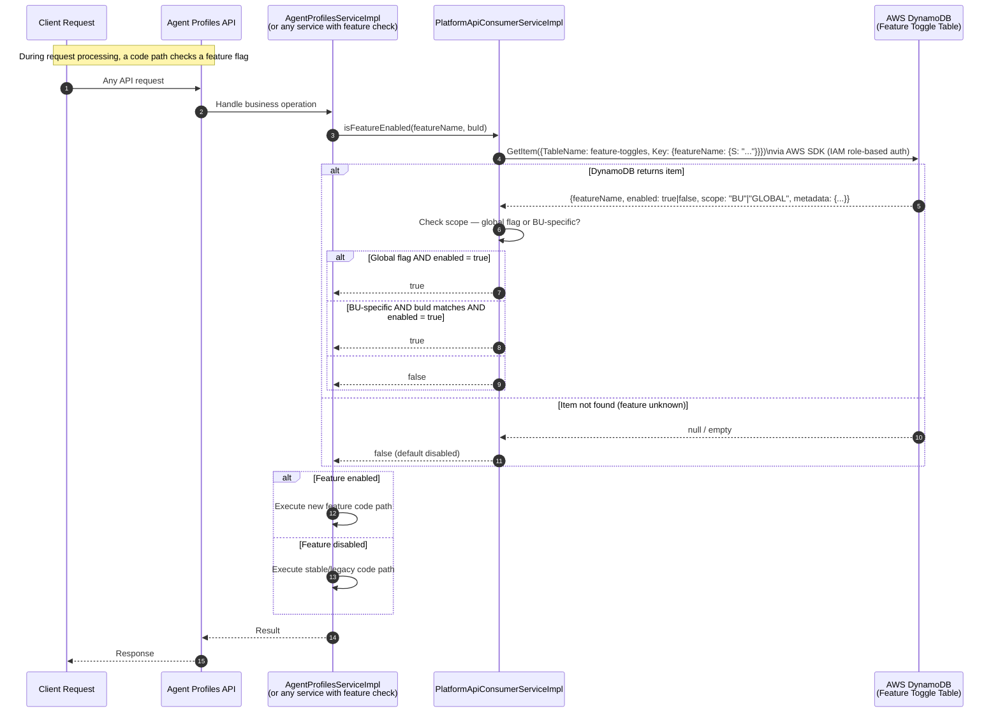

---

## 12. Backend CI/CD Pipeline Flow

End-to-end from developer commit to production image.

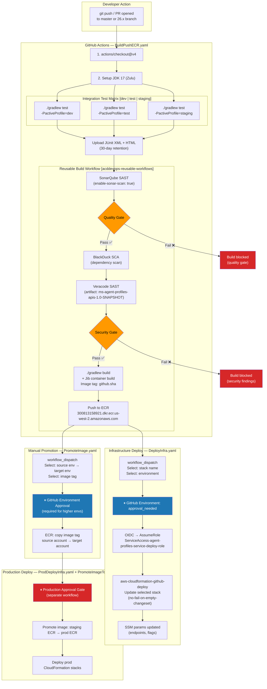

---

## 13. Infrastructure Provisioning (CloudFormation) Flow

How a new environment is fully provisioned using the 8 CloudFormation stacks, showing dependency order.

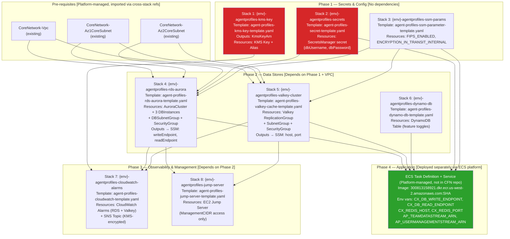

---

## 14. Error Handling & Resilience Flow

How the system handles and propagates errors at each layer.

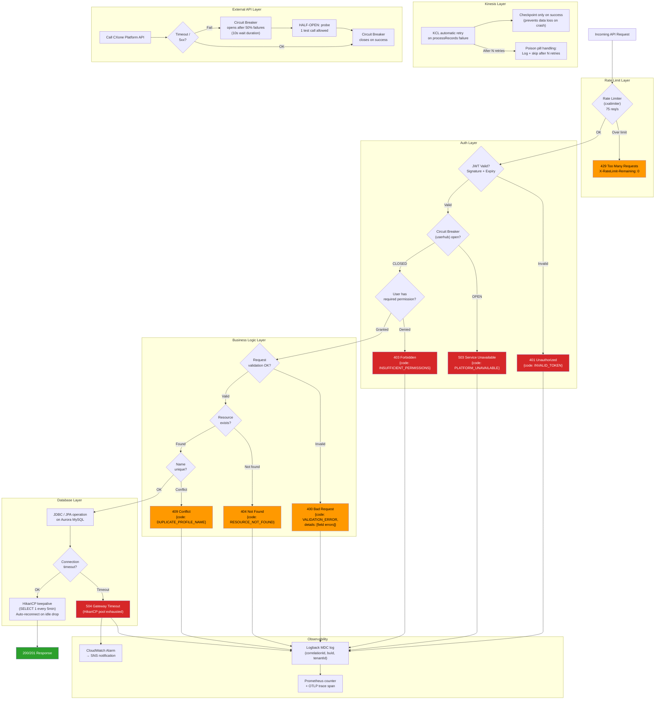

---

## 15. Frontend Bootstrap & MFE Load Flow

How the Angular micro-frontend is loaded, initialized, and connected to the backend when an admin navigates to Agent Profiles in CXone.

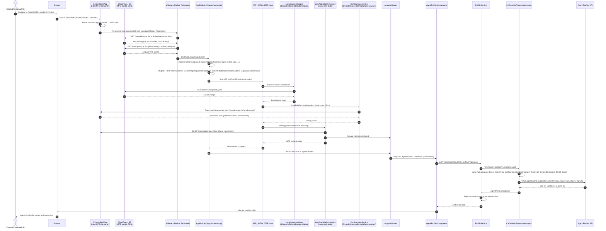

---

## Flow Summary

| # | Flow | Trigger | Key Components | Latency Profile |
|---|------|---------|----------------|-----------------|
| 1 | JWT Validation | Every API request | AuthAspect → AuthService → Caffeine L1 → Persistent L2 → JWKS | Fast (cache hits ~1ms; miss ~100ms) |
| 2 | RBAC Permission Check | Every @Authorized request | AuthAspect → PlatformSvc → Circuit Breaker → Platform API | ~50–200ms (network call) |
| 3 | Get Profiles List | Admin UI load | ProfileService → Cache → Aurora Read | ~5ms (cache hit) / ~50ms (DB miss) |
| 4 | Create Profile | Admin form submit | Controller → Service → DB Write → Cache Invalidate | ~100–200ms |
| 5 | Update Profile | Admin edit save | Controller → Service → DB Read+Write → Cache Invalidate | ~100–200ms |
| 6 | Update Status (Bulk) | Admin status toggle | Controller → Service → DB Write Loop → Cache Invalidate | ~50–500ms (depends on batch size) |
| 7 | Assign Teams | Admin teams tab | Controller → Service → Platform API → DB Write → Cache Invalidate | ~200–500ms |
| 8 | CXA Profile Fetch | Agent desktop login | CXAController → Cache → DB Read | ~5ms (cache hit) / ~50ms (DB miss) |
| 9 | Kinesis TeamData | Team lifecycle event | KCL → TeamDataRecordProcessor → DB Write → Cache Invalidate | Async (~seconds from event publish) |
| 10 | Kinesis UserMgmt | Agent lifecycle event | KCL → UserMgmtRecordProcessor → DB Write → Cache Invalidate | Async (~seconds from event publish) |
| 11 | Feature Toggle | Business logic branch | Service → DynamoDB GetItem | ~5–20ms |
| 12 | Backend CI/CD | git push / PR | GitHub Actions → Gradle → Sonar → Veracode → Jib → ECR | ~15–30 min total |
| 13 | Infra Provisioning | Manual workflow_dispatch | GitHub Actions → OIDC → CloudFormation (8 stacks) | ~20–40 min total |
| 14 | Error Handling | Any error path | Resilience4j → Error response → Logback MDC + OTLP | Inline with request |
| 15 | MFE Bootstrap | Admin navigates to Agent Profiles | Shell → Module Federation → Angular Bootstrap → API | ~1–3s initial load |
